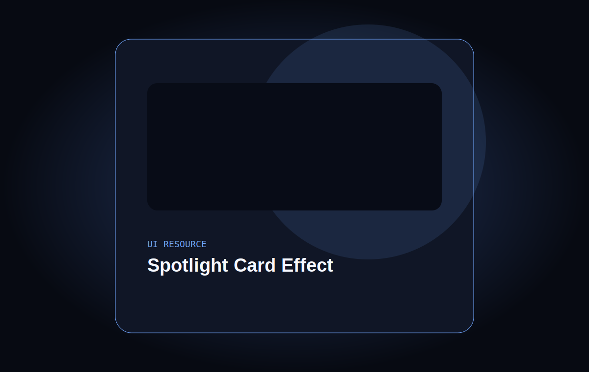

# Spotlight Card Effect

A digital-product card with a spotlight and illuminated border that follow pointer or touch input.

## Features

- Coordinates updated with `requestAnimationFrame`.
- CSS-variable driven border and light.
- Accessible switch to enable or disable the effect.
- Readable content without interaction and mobile adaptation.
- Complete one-block composition for screen capture.

## Live demo

[spotlight.ntdesweb.dev](https://spotlight.ntdesweb.dev/)

## More effect demos

- [3D Product Card](https://card3d.ntdesweb.dev/)
- [Before/After Image Slider](https://fxpreview.ntdesweb.dev/)
- [Hacker Text](https://hacker.ntdesweb.dev/)

## Installation

Clone the repository, enter `spotlight-card-effect`, and open `index.html`.

## Project structure

Semantic HTML, visual CSS, `capture.css` for the complete shot, Vanilla JavaScript, SVG assets, and static Netlify configuration.

## Customization

Change `--accent`, the gradient radii, and the article content.

## Accessibility

The switch exposes `aria-pressed`, content does not depend on the light, and touch receives an equivalent interaction.

## Performance

No dependencies or external images; pointer tracking is grouped by animation frame.

## License and credits

[MIT](LICENSE). Created by [Nacho Torres](https://github.com/NachoTorresRD) for [NTDESWEB](https://www.ntdesweb.com) with [NT-SKILL SUPREME](https://github.com/NachoTorresRD/nt-skill-supreme).

[View on GitHub](https://github.com/NachoTorresRD/spotlight-card-effect) · [Work with NTDESWEB](https://www.ntdesweb.com)
